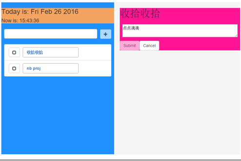

#百度前端学院学习心得

<!-- MarkdownTOC -->

- [1 引言](#1-引言)
- [2 入门](#2-入门)
    - [任务1](#任务1)
    - [任务2](#任务2)
    - [任务3](#任务3)
    - [任务4](#任务4)
- [3 应用](#3-应用)
- [4 心得](#4-心得)

<!-- /MarkdownTOC -->

## 1 引言

大家好，我是长弓#5275，一名非计算机专业的工科硕士研究生。大约一年前，我结束了一年支教生活，回到校园继续自己的学生生活。实验室因为经常接触到一些甲方项目，恰好我这一年处于C/S到B/S的转型阶段，因此我开始接触到前端知识。

刚开始学的时候也没有什么特别懂的师兄带，大家都是瞎子过河，一边看教程一遍试着将之前的Java项目通过前端技术来实现。
后来通过网络了解到百度Web前端学院，试着参加了第一期的培训，受益良多，而且更主要地是了解的外面的世界，看到了一些很犀利的写法，也了解很多思想。

对于我个人来说，我更多地是希望了解一些常识，一些在实际生产环境中的常识。对于我这样一个非计算机专业的学生来说，我很多时候挺希望有一个师傅，告诉我这些东西。而且很多时候这些东西是在搜索引擎，书籍和在线课程中无法学习到的。

## 2 入门

我个人觉得前端知识很杂，从基础的HTML\JS\CSS到一些复杂的框架的使用，以及版本管理和自动化构建工具，包括现在的HTHML5\ES6\Node.js等新技术。真的有很多很多东西可以学，这也对于我们提出两个要求：

1. 抓牢基础
2. 勤于学习

个人感觉如果想要出彩，一定要有非常牢固的基础，例如对于各种标签，各种布局的掌握和不同浏览器中js的实现方式等等。与其把大量时间放在实现各种流行框架的HelloWorld的实现中，不如专一用基础的方法去完成一些常用的轮子。如一个朋友所说：

    每天阅读的习惯还是没扔掉。我倾向于消费“单位投入较多的内容”，出版一本书、发表一篇论文，所花费的功夫必然比发一个朋友圈的帖子或者在知乎上答一个题目来得多，这个“多”，于我而言提供了足够的过滤，

另外，去啃一些大型的资料，不要停留在一些简单的demo中，毕竟写代码也是需要一些全局的眼光，而不是局限在某一些功能点的实现上，即便是某一个功能点，其在实际生产中要求也不一定与简单例子中的要求一样。

回顾一期前端学院中级班的[任务](https://github.com/baidu-ife/ife/tree/master/2015_spring/task)，总共分为四个：

1. 掌握HTML、CSS基础知识、能够较为熟练地使用HTML、CSS编写页面
2. 掌握JavaScript基础知识，能够使用JavaScript编写一些复杂度不大的交互功能。
3. 结合前两个任务所掌握的HTML、CSS、JavaScript知识，实现一个中等复杂度的Web网站实现。
4. 前端工程化。

### 任务1

作为一个很土的工科生，我的CSS确实比较弱，到目前为止也写不出很漂亮的CSS，其实这也是由于之前的训练太少。任务一主要实现了一个个人博客的若干布局：

1. 绝对定位
2. 三列等间隔居中定位，高度自适应于最长列
3. Tab的Hover
4. 搜索框
5. 日历小插件
6. 标签云
7. 分页小插件
8. 瀑布流
9. 时间轴

在2中出现的负边距的应用确实让我头疼了很长一段时间，包括对文档流，浮动流以及元素宽度的各种影响。以及在后面实际项目中遇到的在有Header和Fototer情况中级列随着窗口变化自适应的情况，最后用js解决，可能技术比较菜，并没有找到其他更好的方法。

### 任务2

有两个小任务，一个draggable的小插件，另外一个是autoComplete。这两个都是非常常用的功能。特别是在写draggable的过程当中，因为一开始大家的代码都是传上去的，我也看过好多同学的作品，看看自己写的那叫一个丑，后面也经常去看别人的代码，慢慢的积累。比如后面因为我们的项目需要操作表示电网拓扑的SVG，自己也用AngularJS写了一套用来拖动、缩放、定位（含自动补全的搜索）的directive，也挺有成就。

当然实际上任务2是让我们实现一个mini jQuery，这里也是让我们理解到不同浏览器中的不同实现方法以及sizzle的原理，最后在添加事件绑定中又要去看jQuery里那一套关于事件绑定的机制，花了挺长的时间去理解。

### 任务3

任务3是自己写一个GTD应用，之前在网上看过一个很有意思的项目，就是用不同的框架来实现一个GTD，后面自己也试着用AngularJS和React去实现过。

通过任务3可以了解面向对象式编程，什么原型啊闭包啊this啊以及常用的设计模式。我个人觉得把这个GTD里面的增删改添全部做好，再加上对不同设备的响应式布局，能够都理解以及不错了。15年下半年过得比较蛋疼，为了打发时间用MEAN自己重头做了一遍，花了挺长一段时间，有点头疼。后来又因为赶时髦用Reac+Flux架构重新写了一下View层，如图所示。

### 任务4

任务4讲的是一些工程化的内容，具体情况结合应用一起说把，以为当时学的时候也没有特别认真的看，到了具体应用的时候边做边学的。

## 3 应用

刚开始接触前端，之前也介绍过，是因为实验的项目，毕竟那会儿对前端认识不够，大家都说这就是一写界面的，啥也不懂稀里糊涂在W3C上看了一遍语法就开始瞎写了。

最早的时候，由于大家都不同，也不知道从哪里找来一个叫[DHTMLX](http://dhtmlx.com/)的库，里面有各种小功能，因此对于CSS的要求不高，完全按照它的手册来也能有一个不错的效果。第一个页面很简单，通过Ajax从Oracle数据库里面读出一系列数据，形成表格，然后点击表格触发一个新的查询，根据选择数据的id去数据里面查到另外两组数据展现在下面的表格里面。基本上形成表格也是库里面的工具，完全是学习使用师兄之前的代码写出这么一个页面，大约用了一个月时间，正好写完了研一新生开学。

后来开始写第二个页面，这个页面比较蛋疼的是需要操作之前提到的涉及电网拓扑的SVG，而这个SVG文件是从甲方系统里面导出来的，因此SVG文件内含有大量的原系统中使用的链接和其他功能，并且每个元素的id是与电力CIM数据所对应的。我主要实现两部分的功能：
1. SVG文件的缩放，移动。某些元素的闪烁。
2. 根据服务器中的数据，更新SVG文件中的数字内容。

功能1的问题主要出现在我们使用的那个库，由于这个库的问题，我们不得不把SVG先嵌入到一个iframe中，然后再放到这个库的layout中，然后需要通过[document.getElementById("SVG_ID").getSVGDocument()](http://stackoverflow.com/questions/337293/how-to-check-if-an-embedded-svg-document-is-loaded-in-an-html-page)来对SVG进行操作，存在渲染顺序的问题，而且有了iframe会很烦很绕，以及SVG的缩放的[坐标轴](http://msdn.microsoft.com/zh-cn/library/gg589508(v=vs.85).aspx)问题，也花了不少时间。最终后面再参加完百度学院的培训之后，想来想去还是自己花了一段时间，先搞会了一些基本的CSS布局，双飞翼啊圣杯啊之类的，然后基于AngularJS从重新写了一遍这个项目，这个花的时间有好几个月把，光是在油管上和一些国外的系列网络课程上看资料就看了很久，后面熬了一个礼拜，算是写成了一个简单版，再后面又认真重新学了学AngularJS，又花了两天把逻辑啊视图啊数据啊什么都彻底理清，才有了后面的最终版本。

功能2的主要问题就是一张SVG图片里面有很多线路的数据需要更新，而这些数据文本元素的id又是与电网CIM数据相对应，因此存在大量的[DOM查询](http://www.ruanyifeng.com/blog/2011/08/jquery_best_practices.html)，并且这些DOM查询中又存在大量的子元素遍历，会导致浏览器出现一段时间的卡顿，我一度在想到底是SVG里面的东西太多了，还是我没有使用原生方法的原因，但是后来懒就一直放在这里。也有可能是读数据的然后进行交叉比对时候存在问题。

最后的话，因为论文什么也写的差不多，发现React特别火，很好奇，于是根据网上的教程又去了解了一下React的东西，说实话这方面的材料感觉并没有AngularJS的资料那么好找，也可能是我找的方向不对，比如为了了解Flux的使用对着油管上面Jin Chen的一些没字幕的视频半生不熟地看了之后又去找一些资料，一些资料写的比较浅。后来就结合Express和MongoDB做了之前提到的那个GTD，用MongoDB的原因是在Windows下用Node.js连Oracle的数据库挺[麻烦](https://cnodejs.org/topic/51e4cbbef4963ade0eaecc84)，如果有比较好的方案请多多指导哈。后面有了解了一些关于自动化构建方面的知识，这些网上应该比较多，但是我很想了解实际生产的情况是怎样的，有机会很想去一些互联网公司了解了解真正的前端技术，毕竟我这种半路出家的很少有人告诉我该怎么做。另外，说到Flux，记得之前大漠穷秋的博客里面写到过AngularJS中如果在service中使用$broadcast在作用域间交互，需要更新数据时调用注入的service中的方法，更新完成后发出信号，在接受数据的地方监听信号，这样不是和Flux的思想差不多？个人理解是不是Flux把这些东西全部都放到Action里面了不会那么乱。这里仅仅是个人在学习过程中的一些思考，如果是错的还希望大家指出来。

## 4 心得

记得做任务4那会儿是第一篇论文刚投出去待审的那会儿，正好快放寒假，一天晚上吃完饭一边打着炉石一边看电视机，顺手刷一下系统发现论文被直接拒稿，印象特别深，然后就超颓，不过没办法，人总是要坚强起来的。然后我就坚持不懈，在寒假，通过长时间的努力，终于把炉石打上了传说。

其实现在过得也还可以，在支教结束回来那会儿给自己定下的目标也实现的差不多，唯一的遗憾就是在写代码方面真的还是挺垃圾，很多算法看着没有源码只看文献还是实现不了。也挺感激一年里面参与的项目，自己瞎摸瞎撞的经历感受：比如跟着技术很潮的老师在Git配合着用markdown和LaTex参与写了一本教材，比如刚学会gulp时候心里那种：“哇塞”的土鳖感觉，比如看油管上那些在线视频时候心里那种“嘿嘿嘿”的傻帽儿感觉。

总的来说，前端很杂，通过一段时间的学习说实话自己写代码依旧还是很烂，不过通过学习看到了别人的代码，看到了新的技术理念，收获不小。希望自己有机会能够在写代码这条路上走的更远把。

如果硬要在这里拔高升华一下，写一些名人名言的话，我大概有如下几句话：

1. 扎根基础，往深入处转眼，毕竟看似平凡最奇崛，成如容易却艰辛。

2. 千万不要和女朋友说：“要我和你去逛街，还不如去写代码”。确实，有时候学习新知识的那种感觉是很爽，但这毕竟不是你生活的全部的话。当然，首先你要有有一个女朋友。

3. 注意身体，多去跑跑步，健健身，主要保养头发和腰。
